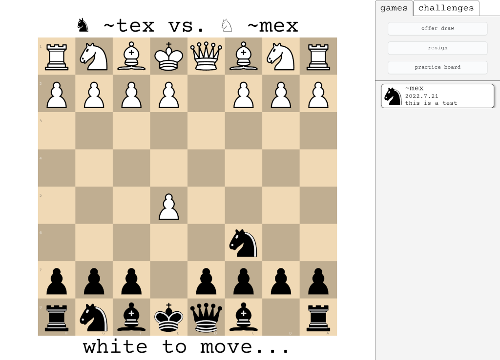

# Chess GUI



## About

[`%chess`](https://github.com/thecommons-urbit/chess-app) is an [Urbit](https://urbit.org) app which allows you to play
chess with other Urbit users. It is a fully-decentralized, peer-to-peer chess application. This repo contains a
browser-based GUI for `%chess`.

## Install

This repo contains only frontend code, without any of the backend Urbit logic. See the
[chess distribution repo](https://github.com/thecommons-urbit/chess) for detailed instructions on how to install the
chess app.

**NOTE:** The above advice is not only for users, but also developers. Developing / testing with a backend is *much*
easier.
In September, 2022, `~bonbud-macryg`, `~nordus-mocwyl`, and `~rovmug-ticfyn` began working on `%chess` in their spare
time for an [Urbit Foundation bounty](https://urbit.org/grants/chess-bounty), which they completed in September, 2023.

## Mission

`%chess` seeks to be a community sandbox for Urbit apps. As Urbit evolves, so too should `%chess`. `%chess` should seek
at all times to incorporate the most modern Urbit programming techniques. It should strive to provide well-documented,
clear, concise code that beginner Hoon coders can use as a reference.

Whether or not `%chess` meets all of these goals at any particular moment, they are the aspirations of the repo.

## News

The "Chess Improvements Bounty" has been completed. Pharaoh has set the chess slaves free!


## Installation

You can find `%chess` on Urbit using the App Search in Grid. Search for `~finmep-lanteb` and you should see
`%chess` as an available app.

Alternatively, you can install from your ship's Terminal:
```
|install ~finmep-lanteb %chess
```

## Development

### 0. Setup your development environment

To spare you from the nightmare that is the JS development environment, the build script is equipped to use
[Docker](https://www.docker.com). If you'd like to use Docker, make sure that you have it
[installed](https://docs.docker.com/engine/install/) and that your user account on your machine has `sudo` privileges.

**NOTE:** [Do not use the 'docker' group](https://fosterelli.co/privilege-escalation-via-docker.html)

If you already inhabit the nightmare realm that is the JS development environment, you can build natively with
[Vite](https://vitejs.dev/). The native Vite build assumes that you have
[npm](https://docs.npmjs.com/downloading-and-installing-node-js-and-npm) installed already.

### 1. Do development stuff


### 2. Build `%chess` code

The `./bin/` directory contains a helper script `build.sh` that will build the source code for you. If the script succeeds,
the output will be located in `./build/`.

#### Docker build

The Docker build is the default. To run it, simply run the build script:
```
./bin/build.sh
```

#### Vite build

To run the build script without Docker, add an `-n` flag like so:
```
./bin/build.sh -n
```

You can also use the `-l` option to run the JS linter and have it auto-fix issues for you:
```
./bin/build.sh -n -l
```

### 3. Install the frontend

Assuming you have [a test ship with `%chess` installed](https://github.com/thecommons-urbit/chess-app#Install), you can
link `%chess` to the compiled frontend for testing.

Login to your dev ship through your browser (the URL at which the ship's interface is running is posted on launch; it
should look something like `http://localhost:8080`). Navigate to the docket glob interface
(`http://localhost:8080/docket/upload`). Follow the instructions on the page to upload the frontend files to your dev
ship. Once globbing is completed, you can access the chess app on the dev ship to confirm that the frontend was
correctly installed.

### 4. Testing the frontend

You can use Vite to test changes to the frontend as soon as you save those changes in your editor. Run your dev ship at
`localhost:8080` and run `npm run dev` in the `/src/frontend` folder, then open `localhost:5173/apps/chess` in any
browser in which you're logged into the dev ship.

You may need to run the following commands in your dev ship's dojo for it to accept requests from Vite:
```
> |cors-approve 'http://localhost:5173'
> |cors-approve 'http://localhost:8080'
```

#### NOTE: About browsers

Google Chrome and Chromium-based browsers have a tough time clearing the cache and picking up changes made to the
frontend. If you're developing the frontend, it's recommended to use Firefox for final testing.

## Contributors

Appearing in alphabetical order of `@p`:

- `~bonbud-macryg` - [@bonbud-macryg](https://github.com/bonbud-macryg)
- `~datder-sonnet` - Tom Holford, [@tomholford](https://github.com/tomholford)
- `~finmep-lanteb` - Alex Shelkovnykov, [@ashelkovnykov](https://github.com/ashelkovnykov), `~walbex`
- `~nordus-mocwyl` - [@brbenji](https://github.com/brbenji)
- `~rovmug-ticfyn` - [@rovmug-ticfyn](https://github.com/rovmug-ticfyn)
- `~sigryn-habrex` - [Raymond E. Pasco](https://ameretat.dev)
